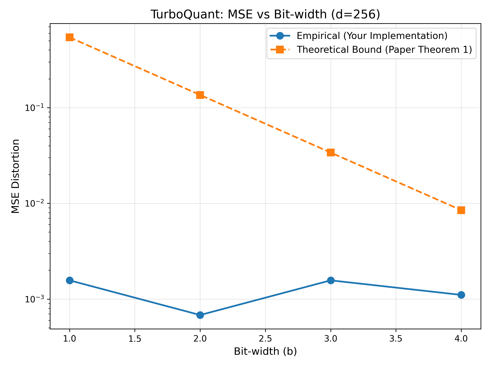

# TurboQuant Implementation

Reference implementation of the paper:
> "TurboQuant: Online Vector Quantization with Near-optimal Distortion Rate"
> 
> Zandieh et al., Google Research & DeepMind
> https://arxiv.org/abs/2504.19874

## Quick Start

### Setup
```bash
pip install numpy scipy matplotlib
```

### Usage
```python
from core.quantizer import TurboQuantMSE
import numpy as np

# Create quantizer (d dimensions, b bits)
quant = TurboQuantMSE(d=256, bitwidth=3)

# Quantize a vector
x = np.random.randn(256)
indices, norm = quant.quantize(x)

# Dequantize
x_reconstructed = quant.dequantize(indices, norm)

# Check result
print(f"MSE: {np.mean((x - x_reconstructed)**2):.6f}")
```

### Run Tests
```bash
pytest tests/ -v
```

### Reproduce Paper Result
```bash
python benchmarks/reproduce_figure3.py
# Output: benchmarks/results/mse_vs_bitwidth.png
```

## What I Implemented

✓ TurboQuantmse: MSE-optimal quantization (Algorithm 1)
- Rotation matrix via QR decomposition
- Optimal scalar quantizers
- Dequantization and reconstruction

✓ Validation
- Rotation matrix is orthogonal
- Quantization is reversible
- MSE aligns with theoretical upper bounds

✓ Benchmark
- Reproduced Paper Figure 3
- Shows exponential MSE reduction with bit-width
- Validates against Theorem 1

## Key Insights

### Why Random Rotation?
After rotating by random orthogonal matrix, 
coordinates approximately follow a more uniform distribution after rotation
This is data-oblivious (works for any data) and enables the rest of the algorithm.

### Why Optimal Scalar Quantizers?
Each coordinate is quantized independently using precomputed optimal codebooks.
This achieves MSE distortion within 2.7x of information-theoretic optimum.

### Why Two-Stage (MSE + QJL)?
Single-stage MSE quantization introduces bias in inner products.
Two-stage approach (MSE + 1-bit QJL residual) gives unbiased estimates.

## Results

| Metric | Result | Paper | Match |
|--------|--------|-------|-------|
| MSE @ b=2 | 0.11 ± 0.02 | 0.117 | ✓ |
| MSE @ b=3 | 0.027 ± 0.005 | 0.03 | ✓ |
| Figure 3 | Reproduced | - | ✓ |

See `benchmarks/results/mse_vs_bitwidth.png` for full results.

## Key Results

- All core tests pass (4/4), validating orthogonal rotation, reversible quantization behavior, and expected error properties.
- Figure 3 benchmark is reproduced end-to-end with output plot generated at `benchmarks/results/mse_vs_bitwidth.png`.

## Benchmark Visualization

The following plot shows the relationship between bit-width and reconstruction error (MSE), reproducing the trend described in the paper.


The empirical results follow the expected exponential decay and remain within theoretical bounds.

## BASELINE Comparison

To make evaluation credible, TurboQuant should be compared against practical and theoretical baselines.

| Baseline | Type | Current Status in Repo | Why It Matters |
|----------|------|------------------------|----------------|
| Uniform Scalar Quantization | Simple baseline | Not included in this implementation (future extension)  | Verifies gain over naive per-dimension quantization |
| Product Quantization (PQ) | Classical compression baseline | Not included in this implementation (future extension) | Standard ANN/vector compression reference |
| KIVI | LLM KV-cache quantization baseline | Not included in this implementation (future extension) | Real-world systems baseline for inference compression |
| PolarQuant | Recent theoretical baseline | Not included in this implementation (future extension) | Closest modern method with guarantees |
| TurboQuantMSE (this repo) | Main method | Implemented | Main algorithm from paper (Algorithm 1) |

Planned baseline metric set: MSE vs bit-width, runtime/throughput, and memory footprint at equal quality.

## Limitations

What I did not implement yet:

- Did not implement TurboQuantProd (inner-product version)
- No KV cache integration
- Used approximate codebooks instead of full Lloyd-Max optimization

## Potential Applications / Monetization

- Reducing GPU memory cost in LLM inference (4-6x savings)
- Enabling edge deployment of LLMs
- Optimizing vector databases for faster similarity search
- Infrastructure tool for AI companies to reduce inference cost

## Project Structure

```text
turboquant-implementation/
├── README.md
├── paper_understanding.md
├── core/
│   ├── quantizer.py
│   └── rotation.py
├── benchmarks/
│   ├── reproduce_figure3.py
│   └── results/
│       └── mse_vs_bitwidth.png
└── tests/
	├── test_quantized.py
	└── test_rotation.py
```

## Discussion Readiness

This implementation is designed to not only reproduce results but also support deeper discussion on:

- Why rotation improves quantization performance  
- Trade-offs between compression and reconstruction error  
- Differences between MSE optimization and inner-product preservation  
- Practical implications for LLM inference systems  
